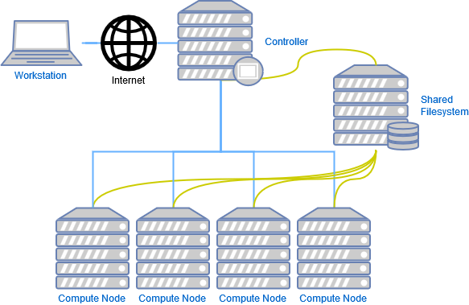

# SLURM Installation

## What's SLURM ?

Slurm overview: https://slurm.schedmd.com/overview.html

> Slurm is an open source, fault-tolerant, and highly scalable cluster management and job scheduling system for large and small Linux clusters. Slurm requires no kernel modifications for its operation and is relatively self-contained. As a cluster workload manager, Slurm has three key functions. First, it allocates exclusive and/or non-exclusive access to resources (compute nodes) to users for some duration of time so they can perform work. Second, it provides a framework for starting, executing, and monitoring work (normally a parallel job) on the set of allocated nodes. Finally, it arbitrates contention for resources by managing a queue of pending work. Optional plugins can be used for accounting, advanced reservation, gang scheduling (time sharing for parallel jobs), backfill scheduling, topology optimized resource selection, resource limits by user or bank account, and sophisticated multifactor job prioritization algorithms.

To summarize, SLURM can:
* Allocate a specific set of ressources from a cluster
* Execute specific actions on these allocated ressources
* Create a queue for all pending job

So ?

It permits to administer the cluster resources safely when there are some process to execute.

### Structure
The SLURM architecture is a **master/slave** structure where a controller commands a set (**cluster**) of independent **nodes**.
A set of nodes defined a **partition** and SLURM can have some partitions. For example, a partition CPU and a partition GPU. The user
doesn't interact directly with the "compute nodes". They are only command by the Controller that will automatically organize
the job/resources allocations. 

All nodes are physically independent. So, it is necessary to have a shared filesystem (nfs,...) to share data across all nodes.

Slurm has a centralized manager, **slurmctld**, to monitor resources and work. There may also be a backup manager to assume those responsibilities in the event of failure. 
Each compute server (node) has a **slurmd** daemon, which can be compared to a remote shell: it waits for work, executes that work, returns status, and waits for more work. 
The slurmd daemons provide fault-tolerant hierarchical communications.

### Jobs

A **job** consists in two parts: **resource requests** and **job steps**

* **Resource requests** consist in a number of CPUs, computing expected duration, amounts of RAM or disk space, etc.

* **Job steps** describe tasks that must be done, software which must be run. A job is a set of 1 or more tasks.
The tasks can be executed iteratively or in parallel by multi-threading or multi-processes, on one or more nodes...

#### Environment

To maintain the integrity of the cluster, the **packages installation on the nodes is forbidden** to guarantee that all nodes
stay identical. Nevertheless, a user may want to install new package. To deal with that, all jobs will **be executed in a container**.

This container provides an unprivileged user-space with its own filesystem. So, all interaction needed by the job will modify the container
environment without any corruption of the host filesystem.

**ATTENTION**: All jobs (**without exception**) must be executed in a container. If not, the integrity of all the cluster will be corrupted.

## Description of the Test architecture

**IMPORTANT**: This tutorial is just for testing. **It is not production-ready** !

1. Material configuration 

For the testing we will create a cluster with these specifications:

| Hostname |       IP        | CPU | Memory |
|----------|:---------------:|----:|--------|
| master   | 192.168.122.214 |   5 | 4Go    |
| node1    | 192.168.122.178 |   5 | 4Go    |
| node2    | 192.168.122.132 |   5 | 4Go    |

**Note**: 
* All theses are a VM. The CPU config is as the machine has 5 sockets filled by 1 CPU with only 1 core and 1 thread by core.
This config is not realistic and has small incidence in the *Slurm* configuration file.
* *Slurm* supports GPUs allocations but, in our tutorial, we will ignore it.

2. Version configuration

| Type   | version |
|--------|---------|
| Debian | 11.4.0  |
| Slurm  | 20.11.4 |
| Enroot | 3.4.0   |
| Pyxies | 0.13.0  |

## Common configuration

1. Update networking configuration

> EDIT: /etc/hosts
> > 192.168.122.214 master \
192.168.122.178 node1 \
192.168.122.132 node2 

2. Create user/group

All users/groups must share same UID/GUID on all master/nodes machines !

`adduser -u 1111 munge --home /var/lib/munge --disabled-password --gecos ""`\
`adduser -u 1121 slurm --home /var/lib/slurm --disabled-password --gecos ""`

3. Munge installation

Munge is used to encrypt the master-nodes communications. In this step, *Munge* is not configured correctly yet !

`apt install -y libmunge-dev libmunge2 munge`\
`systemctl enable munge`

## Master installation

1. Mariadb installation

All job state/history are stored in a mysql database. So it is necessary to install it and configure a database for *Slurm*.

`apt install -y libssl-dev libpam0g-dev libmariadb-dev-compat libmariadb-dev mariadb-server`\
`systemctl enable mysql`\
`systemctl start mysql`\
`pip install PyMySQL`

2. Install pip

`apt install python3-pip`\
`pip3 install --upgrade pip`

3. Mariadb configuration
> INTERACTIVE: mysql -u root
> >create database slurm_acct_db;\
create user 'slurm'@'localhost';\
set password for 'slurm'@'localhost' = password('slurmdbpass'); # Change password !\
grant usage on *.* to 'slurm'@'localhost';\
grant all privileges on slurm_acct_db.* to 'slurm'@'localhost';\
flush privileges;\
exit

4. Slurm installation

Some repertories are not automatically installed. We must create it manually. We have to own these repertories with `slurm`user too
to be sure that *Slurm* daemon can access/read them.

`mkdir -p /etc/slurm /etc/slurm/prolog.d /etc/slurm/epilog.d /var/spool/slurm/ctld /var/spool/slurm/d /var/log/slurm`\
`chown slurm:slurm /var/spool/slurm/ctld /var/spool/slurm/d /var/log/slurm`\
`apt install -y slurm-wlm slurm-wlm-basic-plugins-dev software-properties-common slurmdbd sview`

5. Slurm configuration

**Attention**: Fill correctly these configuration files can be difficult and must be customized according to your needs.
Read carefully the *Slurm* documentation to adapt the *Slurm* comportment to your needs. **A bad configuration can break
the cluster !**

> CREATE: /etc/slurm/slurm.conf - **For more details, visit https://slurm.schedmd.com/slurm.conf.html**
> > ClusterName=HPC\
SlurmUser=slurm\
SlurmctldPort=6817\
SlurmdPort=6818\
AuthType=auth/munge\
StateSaveLocation=/var/spool/slurm/ctld\
SlurmdSpoolDir=/var/spool/slurm/d\
SwitchType=switch/none\
MpiDefault=none\
SlurmctldPidFile=/var/run/slurmctld.pid\
SlurmdPidFile=/var/run/slurmd.pid\
SlurmctldTimeout=300\
SlurmdTimeout=300\
InactiveLimit=0\
MinJobAge=300\
KillWait=30\
Waittime=0\
SchedulerType=sched/backfill\
SelectType=select/cons_tres\
SelectTypeParameters=CR_Core\
SlurmctldDebug=info\
SlurmctldLogFile=/var/log/slurm/slurmctld.log\
SlurmdDebug=info\
SlurmdLogFile=/var/log/slurm/slurmd.log\
JobAcctGatherType=jobacct_gather/linux\
TaskPlugin=task/affinity,task/cgroup\
ProctrackType=proctrack/cgroup\
PrologFlags=Contain\
PropagateResourceLimitsExcept=MEMLOCK\
AccountingStorageType=accounting_storage/slurmdbd\
SlurmctldParameters=enable_configless\
ReturnToService=2\
SlurmctldHost=master \
PartitionName=CPU Nodes=node[1-2] Default=YES MaxTime="UNLIMITED" State=UP Oversubscribe=YES\
NodeName=node[1-2] CPUs=5 SocketsPerBoard=5 CoresPerSocket=1 ThreadsPerCore=1 RealMemory=1000 State=UNKNOWN\
PluginDir=/usr/lib/x86_64-linux-gnu/slurm-wlm\
LaunchParameters=use_interactive_step
>
> CREATE: /etc/slurm/cgroup.conf - **For more details, visit https://slurm.schedmd.com/cgroup.conf.html**
> > CgroupAutomount=yes\
TaskAffinity=no\
ConstrainCores=yes\
ConstrainRAMSpace=yes\
ConstrainSwapSpace=yes\
ConstrainDevices=yes\
ConstrainKmemSpace=no
> 
> CREATE: /etc/slurm/slurmdbd.conf - **For more details, visit https://slurm.schedmd.com/slurmdbd.conf.html**
> > AuthType=auth/munge\
DbdAddr=localhost\
DbdHost=localhost\
SlurmUser=slurm\
DebugLevel=4\
LogFile=/var/log/slurm/slurmdbd.log\
PidFile=/var/run/slurmdbd.pid\
PluginDir=/usr/lib/x86_64-linux-gnu/slurm-wlm\
StorageType=accounting_storage/mysql\
StoragePass=slurmdbpass\
StorageUser=slurm\
StorageLoc=slurm_acct_db

`chown slurm:slurm /etc/slurm/*.conf`\
`chmod 600 /etc/slurm/*.conf`

6. Launch Slurm ecosystem

`systemctl enable slurmdbd`\
`systemctl enable slurmctld`\
`systemctl restart munge`\
`systemctl restart slurmdbd`\
`systemctl restart slurmctld`

## Node Installation

1. Munge configuration

The master and the nodes must share the same key to be able to communicate together. This key is a **secret** and must not
be shared.

`scp /etc/munge/munge.key root@<IP-node>:/etc/munge/munge.key`\
`chown -R munge: /etc/munge/ /var/log/munge/ /var/lib/munge/ /run/munge/`\
`chmod 0700 /etc/munge/ /var/log/munge/ /var/lib/munge/ /run/munge/`

2. Install slurm dependencies

` mkdir -p /etc/slurm /etc/slurm/prolog.d /etc/slurm/epilog.d /var/spool/slurm/ctld /var/spool/slurm/d /var/log/slurm`\
`chown slurm:slurm /var/spool/slurm/ctld /var/spool/slurm/d /var/log/slurm`\
`apt install -y slurm-wlm slurm-wlm-basic-plugins-dev software-properties-common`

4. Configure Slurmd service

*Slurmd* daemon service is not correctly configured
:
1. *Slurmd* get all configuration files remotely for the master (by network). So we have to disable the configuration file 
existence checking.
2. The execution command must be updated to consider the *configless** approach used by *Slurmd* daemon.

> EDIT: /usr/lib/systemd/system/slurmd.service
> > ~~ConditionPathExists=/etc/slurm/slurm.conf~~\
> > ExecStart=/usr/sbin/slurmd -D -d /usr/sbin/slurmstepd --conf-server master $SLURMD_OPTIONS

`systemctl daemon-reload`

5. Update Grub configuration 

*Slurm* doesn't support cgroup v2 so it is necessary to disable it.

> 2. EDIT: /etc/default/grub
> > GRUB_CMDLINE_LINUX="systemd.unified_cgroup_hierarchy=0"

`update-grub`\
`reboot`

6. Launch Slurm ecosystem

`systemctl restart munge`\
`systemctl enable slurmd`\
`systemctl restart slurmd`

## Check installation

1. Check Munge installation
   1. Locally
   
       `munge -n | unmunge`
   
   2. Between master/nodes
   
        `munge -n | ssh <node_in_cluster> unmunge`

2. Check Slurm installation
   1. All daemons service must be `active`
   2. The state of all nodes may be *idle* (use `sinfo`command)
   3. Operational checking: `srun -N2 hostname`

## Install Enroot

1. .deb downloaded from Github

**Important**: Must be installed on all masters and all nodes.

`apt install curl gawk jq squashfs-tools parallel zstd bsdmainutils fuse-overlayfs pigz squashfuse`\
`distribution=$(. /etc/os-release;echo $ID$VERSION_ID)`\
`curl -fsSL https://nvidia.github.io/libnvidia-container/gpgkey | gpg --yes --dearmor -o /usr/share/keyrings/nvidia-container-toolkit-keyring.gpg`\
`curl -s -L https://nvidia.github.io/libnvidia-container/$distribution/libnvidia-container.list | sed 's#deb https://#deb [signed-by=/usr/share/keyrings/nvidia-container-toolkit-keyring.gpg] https://#g' | tee /etc/apt/sources.list.d/libnvidia-container.list`\
`apt update`\
`apt install libnvidia-container-tools`\
`arch=$(dpkg --print-architecture)`\
`curl -fSsL -O https://github.com/NVIDIA/enroot/releases/download/v3.4.0/enroot_3.4.0-1_${arch}.deb `\
`curl -fSsL -O https://github.com/NVIDIA/enroot/releases/download/v3.4.0/enroot+caps_3.4.0-1_${arch}.deb `\
`sudo apt install -y ./*.deb`

## Test Enroot

`curl -fSsL -O https://github.com/NVIDIA/enroot/releases/download/v3.4.0/enroot-check_3.4.0_$(uname -m).run`\
`chmod +x enroot-check_*.run`\
`./enroot-check_*.run --verify`\
`./enroot-check_*.run`

If your installation is correct, you will have:

Kernel configuration:

> CONFIG_NAMESPACES                 : OK\
CONFIG_USER_NS                    : OK\
CONFIG_SECCOMP_FILTER             : OK\
CONFIG_OVERLAY_FS                 : OK (module)\
CONFIG_X86_VSYSCALL_EMULATION     : OK\
CONFIG_VSYSCALL_EMULATE           : KO (required if glibc <= 2.13)\
CONFIG_VSYSCALL_NATIVE            : KO (required if glibc <= 2.13)\
>
> Kernel command line:
>
> vsyscall=native                   : KO (required if glibc <= 2.13)\
> vsyscall=emulate                  : KO (required if glibc <= 2.13)
> 
> Kernel parameters:
>
> kernel.unprivileged_userns_clone  : OK\
> user.max_user_namespaces          : OK\
> user.max_mnt_namespaces           : OK\
>
> Extra packages:
>
> nvidia-container-cli              : OK\
> Extracting [####################] 100%\
> Bundle ran successfully!

## Install Pyxies

1. .deb downloaded from Github

**Important**: Must be installed on all masters and all nodes.

`apt install -y git libslurm-dev build-essential`\
`git clone https://github.com/NVIDIA/pyxis.git` \
`cd pyxis` \
`make install` \
`ln -s /usr/local/share/pyxis/pyxis.conf /etc/slurm/plugstack.conf.d/pyxis.conf`

**Note**: 
* `libslurm-dev` is necessary to install *spank* module for *Slurm*
* `make` can be not installed so we install `build-essential

## Test Pyxies

If *Pyxies* plugin is correctly installed, you will see *Pyxies* options with `srun --help`

## Cluster final test

For testing the cluster install, we will execute a simple command in each node using a ubuntu container.

`srun -N2 --container-image=ubuntu cat /etc/os-release`

> pyxis: imported docker image: ubuntu
> pyxis: imported docker image: ubuntu
> PRETTY_NAME="Ubuntu 22.04 LTS"\
> NAME="Ubuntu"\
> VERSION_ID="22.04"\
> VERSION="22.04 LTS (Jammy Jellyfish)"\
> VERSION_CODENAME=jammy\
> ID=ubuntu\
> ID_LIKE=debian\
> HOME_URL="https://www.ubuntu.com/" \
> SUPPORT_URL="https://help.ubuntu.com/" \
> BUG_REPORT_URL="https://bugs.launchpad.net/ubuntu/" \
> PRIVACY_POLICY_URL="https://www.ubuntu.com/legal/terms-and-policies/privacy-policy" \
> UBUNTU_CODENAME=jammy\
> PRETTY_NAME="Ubuntu 22.04 LTS"\
> NAME="Ubuntu"\
> VERSION_ID="22.04"\
> VERSION="22.04 LTS (Jammy Jellyfish)"\
> VERSION_CODENAME=jammy\
> ID=ubuntu\
> ID_LIKE=debian\
> HOME_URL="https://www.ubuntu.com/" \
> SUPPORT_URL="https://help.ubuntu.com/" \
> BUG_REPORT_URL="https://bugs.launchpad.net/ubuntu/" \
> PRIVACY_POLICY_URL="https://www.ubuntu.com/legal/terms-and-policies/privacy-policy" \
> UBUNTU_CODENAME=jammy

