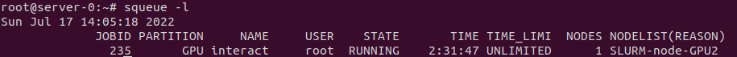

# SLURM documentation

## Get started

To get an access to SLURM, you must be connected to the *controller* (with SSH). It is highly advised to use a *tmux* window on the controller.

### Your first job

There a two main command: `srun` and `salloc`.
* `srun` allocates some resources and uses them to execute **one task**.
* `salloc` allocates some resources and uses them to execute **some tasks** (explained later how). It can be used for 
launching an **interactive session** too.

**Example**: Print `/etc/os-release` with default allocation

Command: `srun --container-image <container_name> hostname`

`srun` is the main command to execute a task. It asks to SLURM to execute the task on the cluster according to the resources allocation.\
`--container-image`: Define which container will be used for executing the task. If no specific containers registry or protocol are indicated,
the container will be imported from DockerHub.\
`hostname`: The command to execute

> root@server-0:~# srun --container-image ubuntu cat /etc/os-release \
> pyxis: importing docker image: ubuntu\
> pyxis: imported docker image: ubuntu\
> PRETTY_NAME="Ubuntu 22.04 LTS"\
> NAME="Ubuntu"\
> [...]

> root@server-0:~# srun --container-image centos cat /etc/os-release \
> pyxis: importing docker image: centos\
> pyxis: imported docker image: centos\
> NAME="CentOS Linux"\
> VERSION="8"\
> ID="centos"\
> [...]

**Important**: By default, a task will automatically use **one** cpu and **no** gpu.

### Environment definition

The container environment can be customized according to your needs:
* `--container-mounts=SRC:DST[:FLAGS][,SRC:DST...]`: Bind mount[s] inside the container. Mount flags are separated with "+", e.g. "ro+rprivate"
* `--container-writable`: Make the container filesystem writable.
* `--container-name`: (**Should not be used currently**) Name to use for saving and loading the container on the host. Unnamed containers are removed after the slurm task is complete; named containers are not. 
If a container with this name already exists, the existing container is used and the import is skipped.

**Note**: For more options, check `srun -h` section "Options provided by plugins".

**Example**: Get an Ubuntu container with a bind mount of /mnt/asr (host) to /workspace/asr (container)

Command: `srun --container-image ubuntu --container-writable --container-mounts=/mnt/asr:/workspace/asr`

### GPUs, CPU Cores and RAM

For executing a job/task, it may be necessary to define specific resources to execute it. *SLURM* has some parameters to custom the
job resources allocation.

Basic allocation commands:

* **CPUs**:
  * `-c, --cpus-per-task=<ncpus>`: Request that *ncpus* be allocated per process.
  * `--cpus-per-gpu=<ncpus>`: Advise Slurm that ensuing job steps will require ncpus processors per allocated GPU.
* **GPus**:
  * `-G, --gpus=[type:]<number>`: Specify the total number of GPUs required for the job
  * `--gpus-per-node=[type:]<number>`: Specify the number of GPUs required for the job on each node included in the job's resource allocation
  * `--gpus-per-task=[type:]<number>`: Specify the number of GPUs required for the job on each task to be spawned in the job's resource allocation
* **RAM**:
  * `--mem=<size>[units]`: Specify the real memory required per node. Default units are megabytes. Different units can be specified using the suffix [K|M|G|T]
  * `--mem-per-cpu=<size>[units]`: Minimum memory required per allocated CPU
  * `--mem-per-gpu=<size>[units]`: Minimum memory required per allocated GPU

**ATTENTION**: Some options can't work together and some options can be implicitly filled according to others explicitly filled options.

**Note**: For more options, visit https://slurm.schedmd.com/srun.html 

**Examples**: Get an interactive session with an allocation of 3 gpus, 10 CPU cores and 5G RAM.

Command: `salloc --gpus=3 -c10 --mem=1G --container-name=nvcr.io#nvidia/cuda:11.6.2-devel-ubuntu20.04`

> Some tests
> 1. **GPUs check**: We can see that only 3 GPUs are visible
> 
> 
> 
> 2. **CPU check**: we can see that only 10 cores are used. Test realized by a benchmark with *sysbench* (sysbench cpu --threads=20 run)
> 
> 
> 
> 3. **RAM check**: We have an *Out-of-memory* error when the memory allocation is too important. 
> Test realized by the creation of a 2Gb file in /dev/shm (stopped after 1GB).\
> For information, /dev/shm is stored in RAM (*tmpfs* memory)
> 
> 

### Nodes and tasks

A job is composed of one or more tasks. According to the allocation, these tasks can be executed in parallel or sequentially.
The allocation permits to control the number of parallel tasks, the resources for each task and the hardware limitations. Following, some standard allocations options:

* `-N, --nodes=<minnodes>[-maxnodes]`: Request that a minimum of minnodes nodes be allocated to this job. A maximum node 
count may also be specified with maxnodes. If only one number is specified, this is used as both the minimum and maximum node count.
* `-n, --ntasks=<number>`: Specify the number of tasks to run
* `--ntasks-per-core=<ntasks>`: Request the maximum ntasks be invoked on each core
* `--ntasks-per-gpu=<ntasks>`: Request that there are ntasks tasks invoked for every GPU
* `--ntasks-per-node=<ntasks>`: Request that ntasks be invoked on each node

**Important**: Be careful with the implicit allocation ! The implicit comportment can be not desired. If possible, use 
well-described allocation command ! Some examples will illustrate this phenomenon in the following part. Create a good allocation can be
tricky. Don't hesitate to consult the documentation and do some tests to verify the comportment of your allocation !

**Examples**:

1. **"Blinded-node" tasks allocation**

Command: `srun -N2 -n5 --container-image=ubuntu hostname`

This command will execute the tasks on 2 nodes with a "blind" selection of the node. 5 tasks will be executed and each will realize the
`hostname`command.

> 

We can observe 2 log messages about importation because the job is running on two nodes.

2. **"Controlled-node" tasks allocation (Implicit `ntask`allocation)**

Command: `srun -N2 --ntasks-per-node=5 --container-image=ubuntu hostname`

This command will execute the tasks on 2 nodes with a limit defined for each node. Indeed, each node will execute 5 tasks or less during this job.

**Important**: Without `--ntasks` parameters, the implicit allocation is to define `--ntasks` = `-N` x `--ntasks-per-node` = 5 x 2 = 10

> 

3. **"Controlled-node" tasks allocation (Explicit `ntask`allocation)**

Command: `srun -N2 --ntasks-per-node=5 -n5 --container-image ubuntu hostname`

This command is similar to the previous one. But, we have defined the `ntasks` value so it is not defined implicitly.

> 

4. **"Blinded-node" Nodes/Tasks/GPUs allocation**

Command: `srun -N2 -n2 --gpus=3 --container-image=nvcr.io#nvidia/cuda:11.6.2-devel-ubuntu20.04 nvidia-smi`

With this command, we allocate only 3 gpus **in total**.

> 

5. **"Controlled-node" Nodes/Tasks/GPUs allocation**

Command: `srun -N2 -n2 --gpus-per-node=3 --container-image=nvcr.io#nvidia/cuda:11.6.2-devel-ubuntu20.04 nvidia-smi`

With this command, we allocate 3 gpus **on each allocated nodes**.

> 

6. **Impossible allocation request**

If a job allocation can't be done, the job will be queued. But, it is possible to request an impossible allocation. *Slurm*,
according to the configuration file describing all available resources in the cluster, can detect it and refuses the job.

Command: `srun -N2 --ntasks-per-node=5 -n11 hostname`

This job specifies the need of 2 nodes with a limit of 5 tasks by nodes. So in this job, we can realize only 10 tasks. But,
the `ntasks` parameter indicates that the job will execute 11 tasks. It is impossible so the job is refused.

> 

**Attention**: Don't try "random" allocation. Even if the *Slurm* control is good, it is not perfect. It may be possible to create
an impossible allocation. In this case, the job will be permanently queued and never executed.

## Salloc and srun philosophy

### Multithread, parallel jobs and configuration

To be simple:
* If you compute a multithread task, play with `cpus-per-task` argument with `ntasks`equal to 1
* If you want parallel tasks, play with `ntasks` argument.

### srun or salloc ?
`srun` is used to execute a blocking request to the cluster. Until the end of the job, the terminal will be blocked. The command
will allocate the resources and do execute the job.

`salloc` realizes only an allocation step only and initiates a bounded environment, specially for interactive mode. It can
be considered as the first step of a `srun` call.

**Attention**:
* `salloc <argument>` will create a bash in one of all compute nodes of the allocation. In this compute node, `srun`command can't work. This command
is useful if you have to create a limited environment in one node only and to execute manually some commands in this node (call a script, do some
actions...).
* `salloc <argument> bash` will create a bash on the master node so you can call `srun`command in an environment limited by your allocation. If you have
only 3 gpus in your allocation, you can't ask for 4 gpus with `srun` inside the `salloc` environment.

## Batch script and complex job

`srun` is a blocking command. Sometimes, we want a "launch-and-forget" approach for a job. To do that, we can use `sbatch` command.
`sbatch` permits to schedule a job according to a script that describes the job. The job will be automatically queued and executed when possible.
For more information, visit https://slurm.schedmd.com/sbatch.html.

**Examples**:

1. **Simple printing...**

* Create a script named `test`

> #!/bin/bash
> 
> #SBATCH --job-name=test\
> #SBATCH --output=/tmp/test.txt\
> #SBATCH --gpus=3\
> #SBATCH --cpus-per-task=3
> 
> cat /etc/os-release\
> nvidia-smi

* Schedule the job with `sbatch test`. If it is done, you will see a message like  `Submitted batch job XXX`. When the resources will be
available, the job will be computed.

* Check your job with `squeue`, `scontrol` to supervise during computation.`sacct`permits to check easily the state of your job too.

* Get your results ! In our case, we want only job stout stored in `/tmp/test.txt` from the node.

>  

**Attention**: 

* In this example, the data are stored locally (i.e in the compute node storage). In a production environment, the
data must be stored in a shared filesystem between all nodes to facilitate the result extraction !

* In this example, we don't use a container so we can get the result from the node filesystem. If we use a container (and you will do it !),
the data will be stored in the container filesystem and destroyed at the end of the job with the container. Be sure to export the result outside
the container with a mount between the host and the container.

2. **Simple printing in a container**

> #!/bin/bash
> 
> #SBATCH --job-name=test\
> #SBATCH --output=/tmp/test4.txt\
> #SBATCH --gpus=1\
> #SBATCH --container-mounts=/tmp:/tmp\
> #SBATCH --container-image=ubuntu\
> #SBATCH --container-writable
> 
> cat /etc/os-release

We have mapped the /tmp of the host with the /tmp of the node to be able to store our result outside the container.

3. **Multiple subtasks with *array* approach** (visit https://slurm.schedmd.com/job_array.html)

> !/bin/bash
> 
> #SBATCH --job-name=test\
> #SBATCH --output=/tmp/job-%A.%a.out\
> #SBATCH --container-mounts=/tmp:/tmp\
> #SBATCH --container-image=ubuntu\
> #SBATCH --container-writable\
> #SBATCH --array=0-4
> 
> echo My SLURM_ARRAY_JOB_ID is $SLURM_ARRAY_JOB_ID\
> echo My SLURM_ARRAY_TASK_ID is $SLURM_ARRAY_TASK_ID\
> echo Executing on the machine $(hostname)

* Result of the 3th task
>  

**Important**: All subtasks stored the stdout in a file but, if the tasks are parallel, the concurrency will be a problem.
To fix this problem, we create an output file for each task. `/tmp/job-%A.%a.out` is a custom name where %A is the job ID and
%a the array ID (automatically modified by *Slurm*). It permits to have different output file for each task.

**Note**: It is possible to limit the parallelization of the tasks with `%<number_max_parallel_tasks>` option in `--array`. 
For example, `--array=0-4%3` for having 3 tasks in parallel for maximum. It can be useful to not saturate the hardware.

4. **Multiple sub-jobs in a job**

You can use `srun` command in a script. The resources used by each `srun` are limited by the `sbatch` allocation. All `srun` can
be executed in parallel if the resources are available. We have to add `&` at the end of sub-job lines to execute the command in foreground and
to add `wait` at the end of script to be sure to not end the job before the ending of all sub-jobs.

**ATTENTION**:

* This approach **is not recommended** because the job will block the resources until the end of the longest `srun`. if possible, choose the *array*
approach.

* To use this approach, **you must not** define the container in the `sbatch` parameters because the commands described below 
will be executed in the container context and `srun` is unknown here. Moreover, all `srun`command will be executed in different container.

> **NOT WORK** !
> 
> > #!/bin/bash
> > 
> > #SBATCH --job-name=test\
> > #SBATCH --output=/tmp/job-%A.%a.out\
> > #SBATCH --container-mounts=/tmp:/tmp\
> > #SBATCH --container-image=ubuntu\
> > #SBATCH --container-writable
> > 
> > srun -n1 --exclusive nvidia-smi &\
> > srun -n1 --exclusive cat /etc/os-release &\
> > wait
> 
> **WORK** !
> 
> > #!/bin/bash
> > 
> > #SBATCH --job-name=test\
> > #SBATCH --output=/tmp/job-%A.%a.out
> > 
> > 
> > srun -n1 --container-mounts=/tmp:/tmp --container-image ubuntu --container-writable --exclusive nvidia-smi &\
> > srun -n1 --container-mounts=/tmp:/tmp --container-image ubuntu --container-writable --exclusive cat /etc/os-release &\
> > wait

## Monitoring

### CLI command

There are 3 commands:
* `sinfo`: View information about Slurm nodes and partitions. For more information, visit https://slurm.schedmd.com/sinfo.html
* `sacct`: Displays accounting data for all jobs and job steps. For more information, visit https://slurm.schedmd.com/sacct.html
* `squeue`: View information about jobs located in the Slurm scheduling queue. For more information, visit https://slurm.schedmd.com/squeue.html
* `sacctmgr`: Used to view and modify Slurm account information. For more information, visit https://slurm.schedmd.com/sacctmgr.html

**Attention**: `sacttmgr` command can modify the account Slurm database and must be used by expert only ! Don't hesitate to use 
`-r, --readonly` option to protect your database.

**Examples**:

1. **Monitoring of all available information about the cluster**

Command: `sinfo -O All`

This command can be used by visualization tool but the result is difficult to read by human. You can obtain more readable result
by use more specific argument (see below).

2. **Monitoring of the used resources**

* **CPU**

Command: `sinfo -O CPUs,CPUsState,CPUsLoad`

>  

In this example, 6 cores are already allocated. 

**Note**: For information, A/I/O/T=allocated/idle/other/total

* **GPU**

Command: `sinfo -O Gres,GresUsed`

>  

In this example, 4 gpus are used on a node. 

**Note**: *Gres* devices are less monitored than cpus and memory.

3. **Monitoring of a specific job**

In this example, we will monitor the information about the job with 235 for ID.

Command: `sacct -j 235` 

>  

**Note**: You can use `-l` for having more information but the printing is less understandable.

4. **Monitoring jobs in queue**

Command: `squeue -l` 

>  
### GUI interface

A GUI interface is available with `sview` command. The GUI is basic but can sufficient for simple monitoring.
